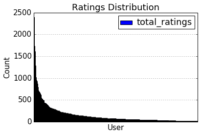

## Introduction
This is the part-1 of a semster long course project for the course "Personalization Theory and application" by Brett Vintch at Columbia University. The aim of this project is to build state of art neighbourhood based, model based and hybrid recommendation systems.

## Dataset
### MovieLens movie rating data
This dataset describes 5-star rating and free-text tagging activity from MovieLens,
a movie recommendation service. It contains 100004 ratings and 1296 tag applications across 9125 movies. 
These data were created by 671 users between January 09, 1995 and October 16, 2016. 
This dataset was generated on October 17, 2016.

### Sampling
This is a sampled dataset provided by MovieLens. They have sampled this data from a larger dataset where users were selected at random for inclusion. All selected users had rated at least 20 movies.

## Business Objective
The objective is to increase the user engagement in the MovieLens rating portal. This objective can be accomplished by suggesting movies to the user that are similar to the movies already rated by the customer (item similarity). This can also be accomplised by suggesting movies to the user that are rated well by similar users (user similarity). This ability to find trend in the rating habits and choices of the user can be exploited to increase the number of ratings in the MovieLens portal. 
We do this by building a recommendation system and suggesting 10 top movies to each user.

## Model selection criteria
The selection criteria is to select a model with high precision recall and low root mean square error(RMSE). This model will be preferred if the time taken for training the model is higher in a resonable range.

We aim to build a model with RMSE of < 2.0 in the test dataset.  

## Required packages 
The model is build using python 2.7 version. Below is a list of packages that have to be installed for the same:

* Pandas: The pandas library provids high-performance, easy-to-use data structures and data analysis tools for Python
* Scikit-learn: Machine learning package for python  
* Matplotlib: Python 2D plotting library
* GraphLab: Machine learning library to build state of the art data products
* Math: Provides access to basic mathematical functions
* Operator: Set of efficient functions corresonding to intristic operators of python 

## Approach
We follow a step by step approach to build this recommendation system: 
1. Data cleaning and exploration 
2. Using GraphLab Package to build the following models 
    1. Memory Based Recommendation - Neighbourhood based/ Collaborative Filtering  
    2. Model Based Recommendation - Matrix Factorization  
3. Building a Hybrid recommendation system 
4. Tuning hyperparameters for each model 
5. Evaluating model performance 
6. Recommending movies based on the finalized model 

### Data cleaning and exploration
Following steps have been followed while exploring data:
* Head of the data to gain idea about the columns and data types present 
* Shape of the dataset 
* Datatype of each column 
* No of Unique values each column in the dataset 
* No of Missing values if present in each column 
* Populate missing values if possible 
* Creating new columns based on available columns, if required 

### Memory based recommendation 
Item-Based collaborative filtering for recommender systems is based on the similarity between items that is calculated using ratings. This models resolves the problem faced in many systems that have many more users than items. A result of this is a more stable rating distribution in the model so the model does not have to be constantly rebuilt as often.

### Model based recommendation 
Memory-based recommendation systems are not always as fast and scalable as we would like them to be, especially in the context of actual systems that generate real-time recommendations on the basis of very large datasets. To achieve these goals, model-based recommendation systems are used. 
Model-based recommendation systems involve building a model based on the dataset of ratings. In other words, we extract some information from the dataset, and use that as a "model" to make recommendations without having to use the complete dataset every time. This approach potentially offers the benefits of both speed and scalability.

*Advantages*:
* Scalability: Most models resulting from model-based algorithms are much smaller than the actual dataset, so that even for very large datasets, the model ends up being small enough to be used efficiently. This imparts scalability to the overall system.

* Prediction speed : Model-based systems are also likely to be faster, at least in comparison to memory-based systems because, the time required to query the model (as opposed to the whole dataset) is usually much smaller than that required to query the whole dataset.

### Hybrid Recommendation 
Personality diagnosis works on the assumption that the active user has a hidden variable, known as a "true personality," that can accurately predict the ratings for the user on all items.

where a is the active user, j is the item, ra(j) is the active user's rating for item j,
n = 50 nearest neighbours
h is the universe of all possible ratings - varied from 0.5 to 5.
Ra and Ri are ratings vectors for commonly rated items of user 'a' and user 'i'

the output of the algorithm gives a dictionary: key: "possible rating"; value: "probability of possible rating". 
We will select the rating which has shown the highest probability. 

For implementation, the above algorithm can be re-written as below:

*Advantages*:
Hybrid model leverages on the existing rating given by the compared user.
It does not require compilation step to incorporate new data. 
Unlike memory based, the results have a meaningful probabilistic interpretation 
Avoids overfitting of model by using hybrid model
    
*Disadvantages*:
Processing of the data takes more time than the other 2 methods. 
Running time of this method increases rapidly with size of the data.    

## File descriptions 
* links.csv: Contains the imdb Id and tmdb ID corresponding to the movieId 
* movies.csv: Contains the title, year of release, genre corresponding to the movieID  
* tags.csv: Contains the tags created by the users corresponding to the movie ID 
* ratings.csv: Contains the ratings created by the users corresponding to the movie ID
The ratings distribution follows a long tail graph as can be seen below:

* Data Exploration and model based recommendor.ipynb :

Follows the above mentioned steps to explore, clean and merge the data. We then consider the Model based approach considering three solvers adaptive gradient stochastic descent,stochastic gradient descent, Implicit Alternating Least Squares. The three models are compared in terms of precision recall and RMSE, we then proceed with the best solver. 

We then try different values of the L2 regularization, compare the models are set the optimum value. Similar approach is followed to set the value of number of latent factors. 

We also train the model on different sample sizes sampled out of the given data and compare the model performances. Note that, since we began with an already sampled dataset, the sub samples are small in size and a clear trend in the model performance is not seen.

We also validated the model on dense subsegment (consisting of users who have rated more 100 movies) and compared the performance on the sparse subsegment (consisting of the users who rated less than 100 movies). 

Following this a 5-fold cross-validation was implemented in which the original sample was randomly portioned into 5 equal subsamples. For each fold, the model was implemented, and the resulting cross-validation error .9933 is the average RMSE of the 5 folds.

* MovieLens Neighborhood Based.ipynb:

Considers the Memory based approach of item based collaborative filtering highlighting the similarity functions of Pearson Correlation and Cosine Similiarity with an implementation of GraphLab that provides an interactive view of the model with the smaller RMSE. Understanding the limitations of scaling this, the file begins to explore ranking factorization that focuses on features and tuning the ranking regularization parameter. The latter half is an exploration of a model based approach which is then explored in a deep dive in a separate notebook.

* Hybrid_Model_Personality_Diagnosis_Algorithm.ipynb :

Ratings.csv file has been imported into a pandas dataframe.
This data frame is further divided into with same shape but one with 80% data, named training and the other with 20% data, named test data set.
A ratings distribution plot has been made to view the distribution. 
Now, test.dataframe has been converted to data matrix and mean user-rating has been subtracted from original ratings.
With this matrix, cosine similarity has been measured and a similarity matrix has been built. This similarity data goes into the building of hybrid model.
Finally, for implementation of our hybrid algorithm, 3 functions have been built: user_train_nn, common_train_items, pd_train_rating.
The function description is as given below:
* user_train_nn: Given input of a user and item pair, the function gives output of atmost 50 nearest neighboring users whose similarities are all positive
* common_train_items: Given an input of 2 users, the function gives a list of items that are commonly rated by the 2 users
* pd_train_rating: This is the final function where our personality diagnosis algorithm gets implemented. Given an input of a active user and the index of item for which rating needs to be predicted, this function gives the probability for each possible rating. Finally, it chooses the ratings which has the highest probability. 

This entire code is implemented on the test dataset and rmse has been computed

    
## Results 
The case study meets the hypothetical business objective of suggesting movies to a user that are similar to the movies already rated by the customer or based on item similarity. The top 10 movies for each user have been suggested in the various models proposed. We met the aim to build a model with RMSE of < 2.0 in the test dataset.

However, we would not be comfortable operationalizing this as the scale of the dataset is minute compared to the scale of data that the business would be requiring in order to provide customers with the best and most informed decisions. Potential watch outs would be that the dataset in use is overfitting to the small dataset and, thus, would not provide the optimal recommendations given the larger dataset size.

The fact that the likes of incomplete information that could be easily mitigated by aggreation to augment the dataset also has not been incorporated into this model is another potential downfall. For example, the model could be altered to produce genre specific recommendations that perhaps may be more accurate. The same logic could apply to actor specific recommendations or various other facets of movies that are a high factor of influence for some users liking a particular film.

Further in the business case, a company may want to constrain the movie choices to either a subset of films that they are streaming or, in the case of a cinema, the movies that have just hit the screens. In either case, the top 10 rated movies by our model are not necessarily the films that would be the best to increase user engagement.

