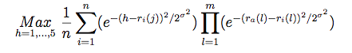
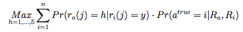

## Introduction
This is the part-1 of a semster long course project for the course "Personalization Theory and application" by Brett Vintch at Columbia University. The aim of this project is to build state of art neighbourhood based, model based and hybrid recommendation systems.

## Dataset
### MovieLens movie rating data
This dataset describes 5-star rating and free-text tagging activity from MovieLens,
a movie recommendation service. It contains 100004 ratings and 1296 tag applications across 9125 movies. 
These data were created by 671 users between January 09, 1995 and October 16, 2016. 
This dataset was generated on October 17, 2016.

### Sampling
This is a sampled dataset provided by MovieLens. They have sampled this data from a larger dataset where users were selected at random for inclusion. All selected users had rated at least 20 movies.

## Business Objective
The objective is to increase the user engagement in the MovieLens rating portal. This objective can be accomplished by suggesting movies to the user that are similar to the movies already rated by the customer (item similarity). This can also be accomplised by suggesting movies to the user that are rated well by similar users (user similarity). This ability to find trend in the rating habits and choices of the user can be exploited to increase the number of ratings in the MovieLens portal. 
We do this by building a recommendation system and suggesting 10 top movies to each user.

## Model selection criteria
The selection criteria is to select a model with high precision recall and low root mean square error(RMSE). This model will be preferred if the time taken for training the model is higher in a resonable range.

We aim to build a model with RMSE of < 2.0 with the precision of and a recall of in the test dataset.  

## Required packages 
The model is build using python 2.7 version. Below is a list of packages that have to be installed for the same:

* Pandas: The pandas library provids high-performance, easy-to-use data structures and data analysis tools for Python
* Scikit-learn: Machine learning package for python  
* Matplotlib: Python 2D plotting library
* GraphLab: Machine learning library to build state of the art data products
* Math: Provides access to basic mathematical functions
* Operator: Set of efficient functions corresonding to intristic operators of python 

## File descriptions 
* Data Exploration and model based recommendor.ipynb :

* MovieLens Neighborhood Based.ipynb:
Considers the Memory based approach of item based collaborative filtering highlighting the similarity functions of Pearson Correlation and Cosine Similiarity with an implementation of GraphLab that provides an interactive view of the model with the smaller RMSE. Understanding the limitations of scaling this, the file begins to explore ranking factorization that focuses on features and tuning the ranking regularization parameter. The latter half is an exploration of a model based approach which is then explored in a deep dive in a separate notebook.

* Model.py :

## Approach
We follow a step by step approach to build this recommendation system: 
1. Data cleaning and exploration 
2. Using GraphLab Package to build the following models 
    1. Memory Based Recommendation - Neighbourhood based/ Collaborative Filtering  
    2. Model Based Recommendation - Matrix Factorization  
3. Building a Hybrid recommendation system 
4. Tuning hyperparameters for each model 
5. Evaluating model performance 
6. Recommending movies based on the finalized model 

### Data cleaning and exploration
Following steps have been followed while exploring data:
* Head of the data to gain idea about the columns and data types present 
* Shape of the dataset 
* Datatype of each column 
* No of Unique values each column in the dataset 
* No of Missing values if present in each column 
* Populate missing values if possible 
* Creating new columns based on available columns, if required 

### Memory based recommendation 
Item-Based collaborative filtering for recommender systems is based on the similarity between items that is calculated using ratings. This models resolves the problem faced in many systems that have many more users than items. A result of this is a more stable rating distribution in the model so the model does not have to be constantly rebuilt as often.

### Model based recommendation 
Memory-based recommendation systems are not always as fast and scalable as we would like them to be, especially in the context of actual systems that generate real-time recommendations on the basis of very large datasets. To achieve these goals, model-based recommendation systems are used. 
Model-based recommendation systems involve building a model based on the dataset of ratings. In other words, we extract some information from the dataset, and use that as a "model" to make recommendations without having to use the complete dataset every time. This approach potentially offers the benefits of both speed and scalability.

*Advantages*:
* Scalability: Most models resulting from model-based algorithms are much smaller than the actual dataset, so that even for very large datasets, the model ends up being small enough to be used efficiently. This imparts scalability to the overall system.

*Prediction speed*: Model-based systems are also likely to be faster, at least in comparison to memory-based systems because, the time required to query the model (as opposed to the whole dataset) is usually much smaller than that required to query the whole dataset.

### Hybrid Recommendation 
Personality diagnosis works on the assumption that the active user has a hidden variable, known as a "true personality," that can accurately predict the ratings for the user on all items.

where a is the active user, j is the item, ra(j) is the active user's rating for item j,
n = 50 nearest neighbours
h is the universe of all possible ratings - varied from 0.5 to 5.
Ra and Ri are ratings vectors for commonly rated items of user 'a' and user 'i'

the output of the algorithm gives a dictionary: key: "possible rating"; value: "probability of possible rating". 
We will select the rating which has shown the highest probability. 

For implementation, the above algorithm can be re-written as below:

*Advantages*:
Hybrid model leverages on the existing rating given by the compared user.
It does not require compilation step to incorporate new data. 
Unlike memory based, the results have a meaningful probabilistic interpretation 
Avoids overfitting of model by using hybrid model
    
*Disadvantages*:
Processing of the data takes more time than the other 2 methods. 
Running time of this method increases rapidly with size of the data.    
    
## Results 

Below are the Results corresponding to the finalized Memory based, Model based and Hybrid recommendation models:

Model | RMSE | Precision | Recall 
------ | ----- | --------- | -------
Memory based | 1.160 | 99 | 88 
Model Based | 0.997 | ii | 88 
Hybrid Based | 1.292 | NA | NA 

